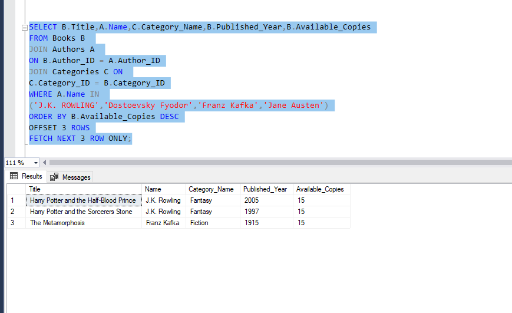
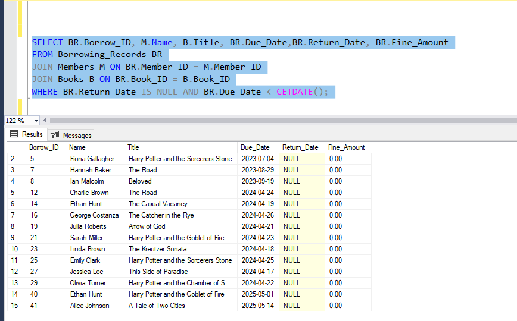
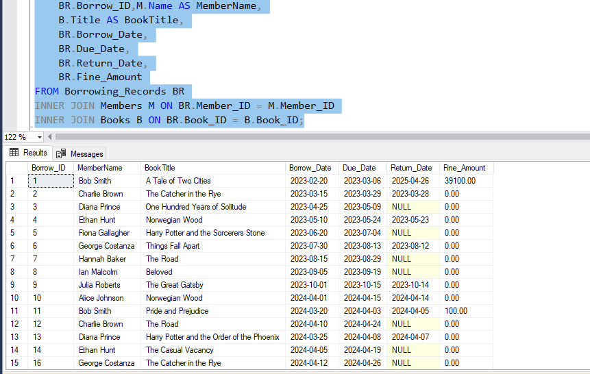

# 📚 Library Management System (LMS) – SQL Project

This is a **Library Management System** designed using **MS SQL Server**. It includes complete database modeling, DDL & DML operations, and advanced SQL features like **Views**, **Stored Procedures**, **Functions**, **Triggers**, and **Transactions**.

---

## 🔧 Technologies Used
- Microsoft SQL Server
- T-SQL (Transact-SQL)
- SSMS (SQL Server Management Studio)

---

## 🗂️ Project Structure

| File | Description |
|------|-------------|
| `01_Create_Database.sql` | Creates database and selects it |
| `02_Create_Tables.sql` | All tables: Books, Authors, Members, etc. |
| `03_Insert_Data.sql` | Sample insert queries for all tables |
| `04_Views.sql` | Useful views like overdue books, category-wise lists |
| `05_Functions.sql` | Scalar and Table-Valued Functions |
| `06_Procedures.sql` | Borrowing, returning, inserting books/members |
| `07_Triggers.sql` | Automations like fine calculation or logging |
| `08_Transactions.sql` | Sample transaction handling (BEGIN, COMMIT, ROLLBACK) |

---

## 📌 Features Implemented

- Create, update, and delete records from all entities
- Use of **foreign keys, constraints, identities**
- Logical **joins** across tables
- Clean **views** for reporting
- **Parameter-based** and reusable functions
- **Stored procedures** for core operations
- **Triggers** to handle automatic tasks (e.g., fine check)
- Safe **transactions** to maintain data consistency

---

## 🧠 Learning Outcome

This project demonstrates mastery of:
- SQL DDL & DML
- Multi-table relationships
- Data integrity enforcement
- Code modularity with procedures/functions
- Real-world transaction handling

---

## ✅ How to Use

1. Run `01_Create_Database.sql`
2. Run `02_Create_Tables.sql`
3. Add some records using `03_Insert_Data.sql`
4. Execute `04_Views.sql` to test reporting
5. Try procedures, functions, and triggers for workflows

> 📌 This project is best viewed and run in **SQL Server Management Studio (SSMS)**.

---

## 📷 Screenshots 

## 🙋‍♂️ Author

**Asad Ali Sajjad**  
📧 Email: [imasad789@gmail.com]  
🌐 LinkedIn: [asad-ali-sajjad](https://www.linkedin.com/in/asad-ali-sajjad)  
🐙 GitHub: [github.com/thisisnotasad](https://github.com/thisisnotasad)

---

## ⭐️ Don’t forget to star the repo if you like it!
